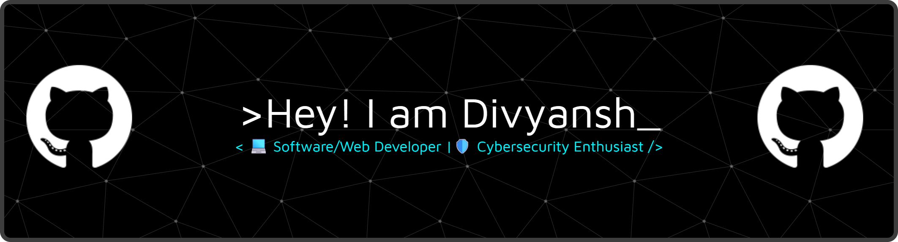

<h1 align="center"></img></h1>

  
  
  
  

---

### 👨‍💻 About Me

- Interested in **OS/Software/Web development**, **low-level software**, **Linux tools**, and **ethical hacking**
- Passionate about **cybersecurity**, **ethical hacking**, and **defensive tooling**
- Enjoy working in **Linux environments**, setting up **virtual labs**, and experimenting with **automation**
- I learn best by **building things**, breaking them, and then securing them again

I’m on a journey to combine **problem-solving**, **systems-level thinking**, and **security awareness** to build tools that make systems more secure and developers more productive.  
Always open to learning, collaborating, and contributing to real-world projects.

---

### 🛠️ Tech Stack

**Languages**
- C • C++ • Python • HTML • JavaScript • Java

**Security Tools**
- Kali Linux • Metasploit • Burp Suite • John
- Wireshark • Tcpdump • Nmap • Gobuster
- Hydra • CAPA • CyberChef • REMnux • FlareVM

**Tools & Platforms**
- Linux (terminal lover)
- Git & GitHub
- GCC, G++
- AI-based prompting & productivity tools

---

### 🔐 Cybersecurity & Interests

- Ethical hacking fundamentals and security mindsets
- Exploring **Linux-based security tools** and **automation scripts**
- Building small utilities that support **recon**, **monitoring**, and **system hardening**
- Building **softwares** and **websites** and making them secure
- Curious about **CTFs**, **red teaming basics**, and **defensive strategies**

---

### 🌱 What I’m Currently Doing

- Strengthening **C/C++** and **Python** for systems and security-focused development
- Experimenting with **Linux environments**, shell scripting, and basic tooling
- Exploring beginner-friendly paths in **OS development** and **low-level programming**
- Building **softwares** and **websites** to enhance my coding skills
- Looking for **collaborative projects** in cybersecurity and software development

---

### 📫 Connect With Me

- GitHub: [github.com/divyanshakya966](https://github.com/divyanshakya966)  
- LinkedIn: [linkedin.com/in/divyansh-shakya-202915378](https://linkedin.com/in/divyansh-shakya-202915378)
- TryHackMe: [tryhackme.com/p/divyanshakya966](https://tryhackme.com/p/divyanshakya966)
- Twitter: [x.com/divyanshakya966](https://x.com/divyanshakya966)

💬 Feel free to reach out if you’d like to **connect, collaborate, or brainstorm** ideas around:
- Cybersecurity & ethical hacking  
- Linux tools and automation  
- Low-level / systems programming  
- Software / web development projects  

---

### 🛠️ Tech and Tools I Use

  

  

---

 

---

⭐ If you like my work or want to follow my journey, consider dropping a **star** on the repos you find interesting!

---
